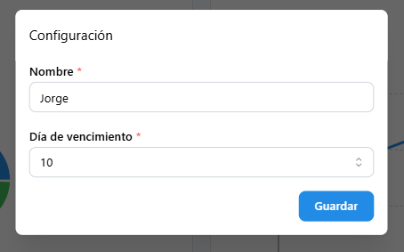
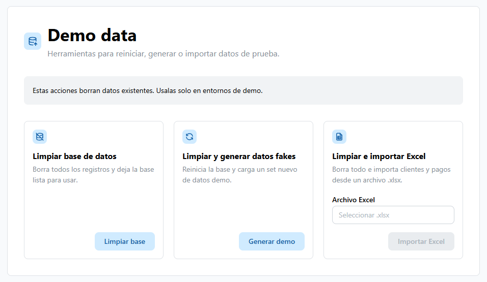
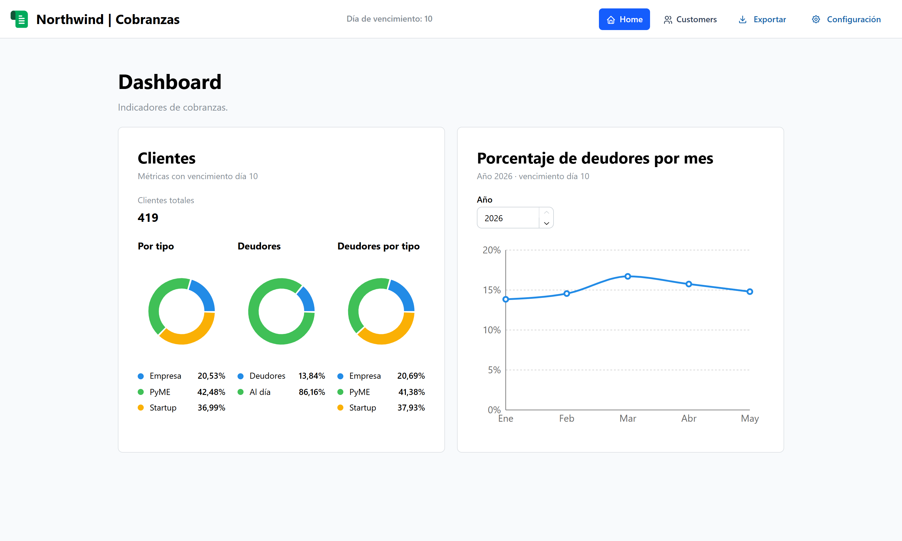
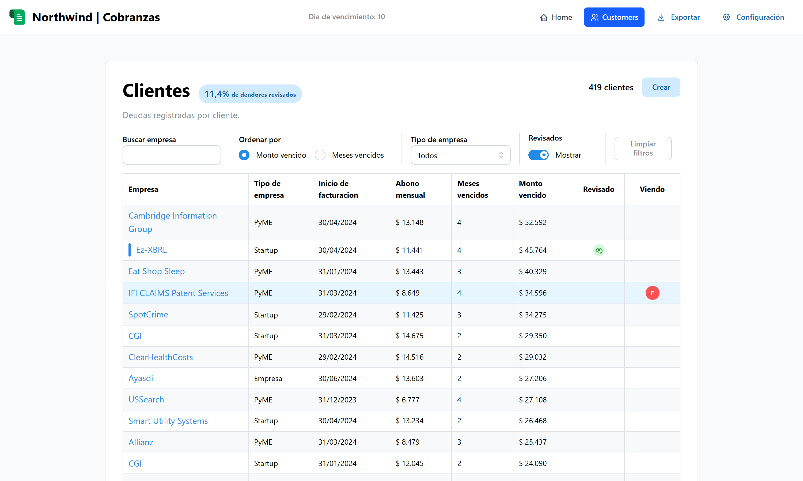
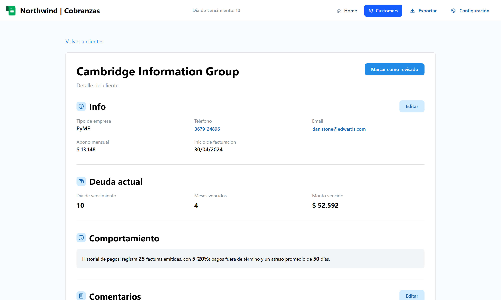
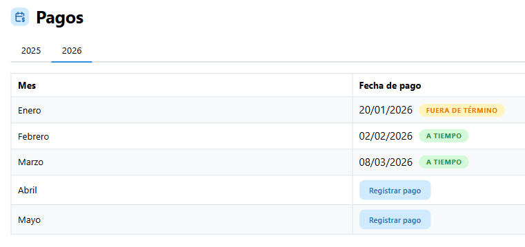
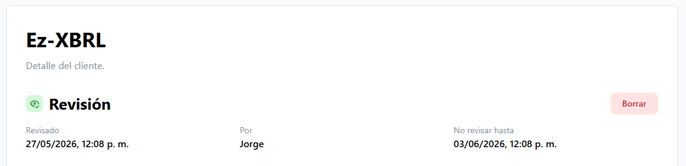
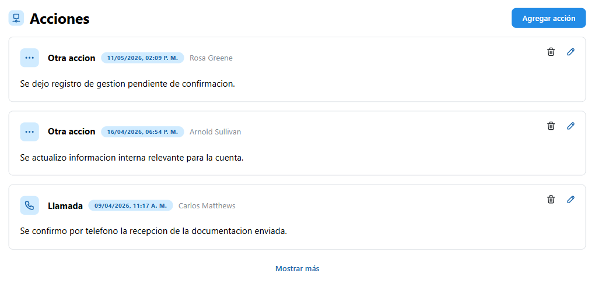
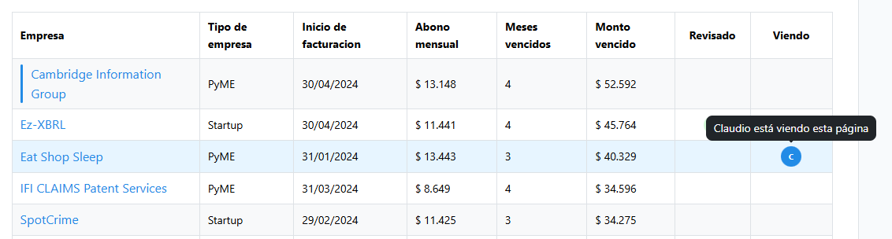
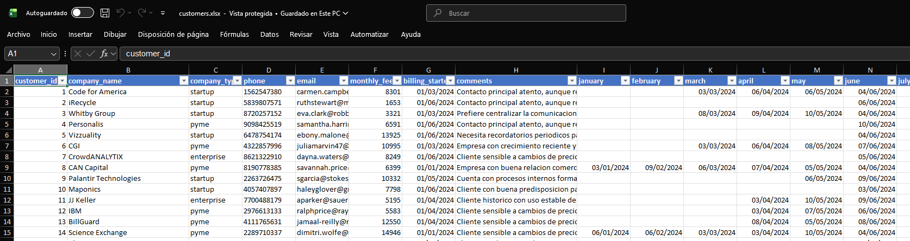

## Northwind | Cobranzas

La app representa la información que podría haber en una hoja de google sheets como esta:

https://docs.google.com/spreadsheets/d/1NfhMktK7vfVAC9iF6CZg35eDfDqau7zyyu3rrARrfVc/edit?usp=sharing

Primer ingreso: se debe establecer un nombre de usuario y un día de cobro del mes, de este valor va a depender el comportamiento de toda la app.

Ambos valores pueden ser modificado luego desde "Configuracion"

### Funcionalidades principales

#### Restaurar o generar datos para la demo

Ingresando directamente a `/demo`, se pueden reiniciar los datos de las tablas, generar nuevos, o importar un excel. 

#### Dashboard de cobranzas

- Métrica de clientes totales.
- Distribución de clientes por tipo: Empresa, PyME y Startup.
- Porcentaje de deudores.
- Deudores por tipo de empresa.
- Gráfico mensual de morosidad por año y día de vencimiento.

#### Gestión de clientes

- Listado paginado de clientes con deuda.
- Ordenamiento por monto adeudado o meses vencidos.
- Filtros por nombre de empresa, tipo de empresa y estado de revisión.
- Alta de nuevos clientes desde modal.
- Persistencia de filtros y última navegación.

#### Detalle de cliente

- Visualización de datos comerciales del cliente.
- Edición de datos del cliente.
- Visualización de deuda actual: meses vencidos, monto vencido y día de vencimiento.
- Registro y edición de comentarios.
- Desactivación de cliente.

#### Pagos

- Historial de pagos agrupado por año.
- Visualización mensual de pagos realizados y pendientes.
- Registro de pagos por mes.
- Indicación de pago a tiempo o fuera de término según día de vencimiento.

#### Revisiones de deuda

- Marcado de cliente como revisado por una cantidad de días.
- Registro del informante que realizó la revisión.
- Visualización de fecha de revisión y fecha hasta la cual no debe revisarse.
- Eliminación de revisión.
- Indicador visual en el listado para clientes revisados.

#### Acciones de seguimiento

- Registro de acciones sobre un cliente: llamada, email, visita u otra.
- Asociación de acciones al informante actual.
- Edición de comentarios de acciones.
- Eliminación de acciones.
- Historial ordenado de acciones por cliente.

- Configuración inicial obligatoria de nombre del informante.
- Configuración del día de vencimiento usado para calcular deuda y morosidad.
- Persistencia local de nombre, día de vencimiento y user ID.

#### Colaboración en tiempo real

- Conexión por WebSocket para mostrar qué usuarios están viendo cada cliente.
- Avatares con iniciales de otros informantes activos.
- Indicador visual en la tabla cuando un cliente está siendo consultado por otro usuario.

#### Exportación de datos

Se pueden exportar todos los datos a una planilla excel desde el botón "Exportar"

